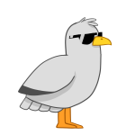

<h1><i>It's showtime, folks</i></h1>

### 🏕️ What's up!

— Good to see you. It's been awhile...

### 👋 My name is Denis Bronzov.

— Just a _web aesthetics lawyer_ 🎁 and _Front-end_ web 🕸 developer 🧑‍💻.

### 💻 I am currently working for [MyJS Web Docs](https://github.com/mjdocs).

— Owner ✨ of [_MyJS Web Docs_](https://github.com/mjdocs).

<h1><i> My stats</i></h1>

 

<h1><i>Hard skills</i></h1>

### 🎖️ My tech stack:

  
  
  
  
  
  
  
  
  
  
  
  
  
  
  
  

### 🎀 Achievements

    

