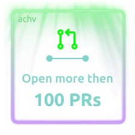
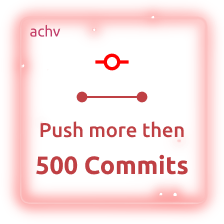

<h1><i>It's showtime, folks</i></h1>

;%E2%9E%9C+CreateImmutableBinding();%E2%9E%9C+Unicode+Code+Point>)

### 🏕️ What's up!

— Good to see you. It's been awhile...

### 👋 My name is Denis Bronzov.

— Just a _web aesthetics lawyer_ 🎁 and _freelance Front-end web_ 🕸 _developer_ 🧑‍💻.

### 💻 I am owner ✨ of [_MyJS Web Docs_](https://github.com/mjdocs).

— Currently working on a _[MyJS Web Docs](https://github.com/mjdocs)_ — ECMAScript spec _documentation_

<h1><i> Total stats</i></h1>

<h1><i> Tech stack</i></h1>

  
  
  
  
  
  
  
  
  
  
  
  
  
  
  
  
  
  

 

<h1><i> Achievements</i></h1>

    
    
    
    
    

 

